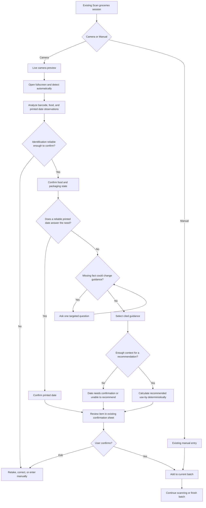

# AI-Assisted Food Intake and Recommended Use-By Dates

Status: feature concept, MVP specification, and mocked low-fidelity flow  
Product: CROCS Refrigerator Inventory  
Last updated: August 20, 2026

## Decision summary

This feature should extend CROCS's batch-oriented intake flow through one unified camera. Barcode, visual-food, and printed-date recognition should be implementation details, not separate scanner modes or inventory systems.

The existing flow already has the right product seams:

- a continuous scanner session and batch queue;
- item-level confirmation and correction;
- a manual-entry fallback;
- explicit `identified`, `likely-match`, and `needs-review` states;
- distinct package-date and estimated-date labels;
- an inventory details view with an estimate basis;
- local persistence of the item and how it was entered.

The proposed feature presents only **Camera** and **Manual**. The camera searches for barcodes, recognizable food, and printed dates automatically. It uses multimodal recognition to reduce typing, asks only safety-relevant questions when needed, obtains a cited storage range, and then uses deterministic date arithmetic to create a **recommended use-by date**. The user reviews the result in a confirmation sheet and adds it to the same batch.

For the simplest trustworthy MVP, CROCS should support one food item per photo and a small, versioned set of common refrigerated-food guidance. Multiple-item photos, broad manufacturer lookup, and unconstrained live web research should remain later experiments.

### Mocked prototype checkpoint

The current prototype now includes a low-fidelity unified camera inside the scanner session. On first use, tapping the ready preview explains why camera access is needed. Granting simulated access opens a fullscreen feed; declining it produces iPhone Settings guidance and a Manual fallback. The camera then detects a demo product automatically and asks “Is this it?” before adding it. The same camera can branch into visual-food recognition for unpackaged food. It supports two deterministic research scenarios:

- leftover tuna, with identity confirmation, preparation date, refrigeration history, a cited recommendation review, and return to the existing batch;
- sealed salsa with a clear printed date, demonstrating that the system skips unnecessary follow-up questions.

The interaction now also includes a pre-analysis photo review, unclear-photo recovery, analysis retry, camera-unavailable fallback, and a correction handoff that prefills the corrected food name in manual details. See the [photo intake journey map](photo-intake-journey-map.md) for the current state inventory and test hypotheses.

The camera prototype also exposes five repeatable uncertainty scenarios: no detected product, multiple items in view, low-confidence candidates, disagreement between barcode and visual results, and an unreadable printed date. Each state avoids automatic acceptance and converges on retry, correction, or prefilled manual review.

No live model or external AI service is connected. The new path is intended for interaction testing before server/API work.

## Existing product and technical context

### Current product flow

The React prototype is currently framed as a low-friction camera workflow for adding several groceries in one continuous session:

1. Start **Scan groceries** from Home, My Fridge, or the bottom navigation.
2. Open the camera and simulate automatic barcode or visual-food recognition.
3. Review the detected item, quantity, and either a package date or estimated use-first date.
4. Confirm and continue without leaving the scanner.
5. Review only uncertain items at the end of the batch.
6. Add the reviewed batch to My Fridge.

Manual entry is already available inside the batch. Camera/upload, analysis, recovery, and suggestion-review screens are connected through the unified camera and its collapsed edge-case controls. They support the same batch rather than creating a second product flow.

### Current stack and constraints

- React 19, TypeScript, and Vite.
- Client-only state and `localStorage` persistence.
- Deterministic demo fixtures for barcode recognition and date estimation.
- No backend, account system, cloud sync, API credential handling, or production image storage.
- `InventoryItem.expiresAt` currently represents both confirmed package dates and estimated dates; `dateType` distinguishes the two.
- The product language currently uses **estimated use-first date**. This concept should standardize AI-derived dates as **recommended use-by date** while retaining the product's broader “use first” prioritization language.

### Fit within CROCS

Recognition belongs inside the existing scanner session:

- **Camera** is the single entry point for packaged groceries, produce, leftovers, homemade foods, opened packages, and printed dates.
- Barcode and visual recognition may remain separate services internally, but the user should not have to choose between them.
- **Manual entry** remains the resilient fallback.
- Both user-facing paths produce the same batch item shape and converge on the existing batch-review and inventory flows.

This preserves the project's current research focus on reducing intake friction across several groceries while expanding the difficult cases the barcode path cannot resolve.

## Problem and product principle

Many refrigerated items lack a usable printed date once food is cooked, opened, portioned, or removed from its original package. A photo can reduce input effort, but appearance alone cannot establish food safety or a precise date.

The feature's purpose is:

> Use multimodal understanding to reduce manual entry, identify missing context, ask the minimum necessary follow-up questions, retrieve trustworthy storage guidance, and convert that guidance into an understandable inventory recommendation.

It must not behave as:

> Take a picture and guess when the food expires.

## Goals

- Reduce typing for foods that are difficult to barcode or manually describe.
- Reuse the current continuous batch workflow.
- Ask only questions whose answers could change the recommendation or prevent one.
- Clearly separate printed dates from AI-assisted recommended use-by dates.
- Ground every recommendation in preserved, inspectable guidance.
- Provide correction, retry, and manual-entry paths at every uncertain stage.
- Make deterministic policy and date calculations testable independently of the model.

## Non-goals for the MVP

- Declaring food safe based on appearance, smell, or a photo.
- Diagnosing contamination or foodborne illness risk.
- Supporting multiple foods in one image.
- Identifying exact brands or products when the label is not readable.
- Searching arbitrary websites for safety guidance.
- Handling frozen, pantry, restaurant transport, or power-outage scenarios comprehensively.
- Personalizing recommendations for pregnancy, immune compromise, or other higher-risk populations.
- Replacing printed manufacturer dates.
- Sending OpenAI requests directly from the browser.

## Users and primary scenarios

### Clear packaged item

A sealed jar has a readable product label and printed date. CROCS extracts the product and printed date, labels the date as printed, and asks for a single confirmation. No recommended use-by date is invented.

### Opened packaged item

An opened container is identifiable, but its useful storage window depends on when it was opened and whether it stayed refrigerated. CROCS confirms the identity, asks for the opening date if missing, asks about refrigeration only if it could change the recommendation, then applies cited guidance.

### Leftover or homemade food

A photo appears to show cooked chicken, tuna salad, or a homemade meal. CROCS confirms the food category, asks when it was prepared or opened, and checks continuous refrigeration. It then derives a recommended use-by date from a relevant storage range.

### Insufficient or risky context

The photo is unclear, the user does not know when the food was prepared, or the food may have spent significant time unrefrigerated. CROCS does not generate a precise date. It explains what is missing, offers authoritative guidance when applicable, and keeps manual entry or “date needs confirmation” available.

## Proposed low-fidelity user flow



### Suggested screen sequence

1. **Scanner session:** Camera and Manual are the only two methods. The camera preview is ready immediately.
2. **Fullscreen camera:** search automatically for one item, its barcode, and any readable printed date; no shutter is required for the primary path.
3. **Analyzing:** cancellable progress; no unsupported claims.
4. **Confirm identification:** “This looks like tuna. Is that correct?” plus confidence language, edit, retry, and manual paths.
5. **Targeted question:** one question per screen, with quick answers such as Today, Yesterday, Pick a date, and Not sure.
6. **Recommendation review:** food name, printed date when present, recommended use-by date when derived, guidance range, known context, confidence, and source.
7. **Existing confirmation/batch sheet:** confirm and continue, edit, or inspect why.
8. **Existing batch review:** show only items requiring attention.

## Minimum-information policy

The model may identify potentially missing facts, but a deterministic policy should decide whether CROCS actually asks a question.

### Question priority

1. **Identity gate:** ask for confirmation when the food category affects the storage rule or visual confidence is below the product's evaluated threshold.
2. **Safety gate:** for perishable prepared/opened food, ask whether it remained refrigerated if that fact is unknown.
3. **Date anchor:** ask when it was opened, cooked, prepared, or purchased only when a cited rule needs that anchor.
4. **Specificity:** ask a brand or product question only when exact manufacturer guidance is available and would materially change the result.

### Stop rule

Stop asking as soon as all of the following are true:

- the food maps to a supported storage-guidance category;
- the relevant state is known, such as raw, cooked, opened, or sealed;
- a usable anchor date is known;
- required storage-condition checks are known;
- no unresolved answer could select a different rule or prevent a recommendation.

Identity confirmation does not count against a proposed MVP limit of two safety/context questions. If more than two context questions would be required, CROCS should offer manual details or return **unable to recommend** instead of turning intake into a long conversation.

### “Not sure” handling

“Not sure” must be a valid answer. It should never be silently converted to the most convenient assumption.

- Unknown identity: request correction, retake, or manual entry.
- Unknown anchor date: do not fabricate a date; save as **date needs confirmation** if the user continues.
- Unknown refrigeration or time at room temperature: show the relevant authoritative caution and do not issue a high-confidence recommended date.
- Conflicting inputs: surface the conflict and ask only the one question needed to resolve it.

## Recommendation semantics

### Printed date

- A literal date visibly printed on the package.
- Preserve the visible label type when possible: `use by`, `best if used by`, `sell by`, or `unknown printed date`.
- Always require user confirmation before saving OCR output.
- Never relabel it as AI-generated.

### Recommended use-by date

- A CROCS recommendation derived from a cited storage range, a known anchor date, and storage context.
- Never described as a guaranteed expiration date.
- Should use the conservative end of the applicable safe range when a range is supplied.
- Must preserve the inputs and source used to calculate it.

### Unable to recommend

Use this state when the system cannot identify an applicable rule, lacks a critical anchor or storage fact, cannot reach an approved source, or receives conflicting evidence it cannot resolve. The user may still save the item with **date needs confirmation**.

## MVP scope

### Included

- One item per photo, taken or uploaded from the existing scanner session.
- Food identification and coarse state classification: packaged, produce, raw, cooked, leftover, opened, or unknown.
- Visible brand, barcode, and printed-date extraction when present.
- User confirmation of identity and any printed date.
- At most two safety/context questions after identity confirmation.
- Versioned, curated guidance for approximately 10–15 common refrigerator categories, initially including common leftovers, cooked meat/poultry, raw poultry, soups/stews, pizza, opened lunch meat, eggs, and a few produce/opened-package cases for which authoritative guidance is clear.
- Deterministic recommended-use-by calculation.
- Source, confidence, and concise rationale in the item review and details screens.
- Existing edit, manual fallback, batch review, and local inventory behavior.
- Mock service adapters so the research prototype can test the flow without a live API.

### Deferred

- Several grocery items in one photo.
- Manufacturer-domain search and product-specific policies.
- Open-ended per-item live web search.
- Barcode OCR from the same photo as a production feature.
- Accounts, cloud image storage, notification delivery, and shared households.
- Personalized medical-risk advice.
- Model learning from individual users or cross-user corrections.

## Deterministic responsibilities versus model responsibilities

| Concern | Deterministic system | AI model |
| --- | --- | --- |
| Image preparation | File/type limits, resize, crop, EXIF removal | None |
| Visual understanding | Validate schema and confidence ranges | Identify likely food, packaging state, visible text, brand, barcode candidate, and printed-date candidate |
| Uncertainty | Thresholds and UI state selection | Return uncertainty and alternatives; never assert certainty |
| Follow-up questions | Apply question priority, maximum count, and stop rule | Identify which facts may be missing and phrase a concise candidate question |
| Guidance retrieval | Approved domains/rules, source validation, caching, versioning | Form a narrow query and summarize the matched guidance when a curated rule is unavailable |
| Rule selection | Validate compatible food state, storage state, and anchor type | Map observations to a controlled food category; suggest candidate rule IDs |
| Date calculation | Add the conservative guidance duration to the confirmed anchor date; timezone-safe calendar math | None |
| Conflict handling | Source priority and conservative tie-break policy | Summarize the difference in user-facing language |
| Inventory creation | IDs, timestamps, field mapping, persistence, migration, audit metadata | Supply structured observations only |
| Explanations | Render known fields and citations | Produce a short user-facing summary from allowed factors, not private reasoning |
| Safety fallback | Block unsupported recommendations and preserve manual entry | Return `insufficient_information` or refusal states when appropriate |

The model should not be the final authority on whether enough information exists, which source is allowed, or what calendar date is stored.

## Proposed data model

The current `expiresAt` field is overloaded. New work should separate observed package information from the system recommendation while keeping a temporary compatibility field for existing screens.

```ts
type ConfidenceLevel = "high" | "medium" | "low";
type RecommendationStatus =
  | "printed-date-only"
  | "recommended"
  | "needs-confirmation"
  | "unable-to-recommend";

interface PrintedDateObservation {
  value?: string; // YYYY-MM-DD only after deterministic parsing
  labelType: "use-by" | "best-by" | "sell-by" | "unknown";
  rawText?: string;
  confidence: ConfidenceLevel;
  userConfirmed: boolean;
}

interface StorageGuidanceEvidence {
  ruleId: string;
  sourceName: string;
  sourceUrl: string;
  sourcePublisher: "USDA-FSIS" | "FDA" | "FoodSafety.gov" | "manufacturer";
  sourceReviewedAt?: string;
  retrievedAt: string;
  rangeDays: { min: number; max: number };
  anchorType: "opened" | "prepared" | "cooked" | "purchased" | "thawed";
  storageCondition: "refrigerated";
}

interface RecommendationContext {
  openedAt?: string;
  preparedAt?: string;
  cookedAt?: string;
  purchasedAt?: string;
  continuouslyRefrigerated?: boolean;
  roomTemperatureRisk?: "no" | "possible" | "yes" | "unknown";
}

interface FoodRecommendation {
  status: RecommendationStatus;
  recommendedUseBy?: string;
  guidance?: StorageGuidanceEvidence;
  context: RecommendationContext;
  confidence: ConfidenceLevel;
  reasoningSummary: string; // concise, user-facing factors only
  aiAssisted: boolean;
  modelMetadata?: {
    provider: "openai";
    model: string;
    schemaVersion: string;
  };
}

interface InventoryItemV2 extends InventoryItem {
  photo?: { localUrl?: string; retained: boolean };
  foodCategory?: string;
  foodState?: "packaged" | "produce" | "raw" | "cooked" | "leftover" | "opened" | "unknown";
  storageLocation?: "refrigerator";
  printedDate?: PrintedDateObservation;
  recommendation?: FoodRecommendation;
  // Keep expiresAt/dateType during migration, derived from the confirmed
  // printed date or recommendation used by current sorting UI.
}
```

### Model output contract

The model response should describe observations and gaps, not directly create an inventory record:

```ts
interface FoodImageAnalysis {
  foodIdentification: {
    primary: string;
    alternatives: string[];
    confidence: ConfidenceLevel;
  };
  brand?: { value: string; confidence: ConfidenceLevel };
  barcode?: { value: string; confidence: ConfidenceLevel };
  printedDate?: {
    rawText: string;
    candidateIsoDate?: string;
    labelType: "use-by" | "best-by" | "sell-by" | "unknown";
    confidence: ConfidenceLevel;
  };
  foodCategoryCandidate?: string;
  foodState: "packaged" | "produce" | "raw" | "cooked" | "leftover" | "opened" | "unknown";
  packagingState: "sealed" | "opened" | "transferred" | "unpackaged" | "unknown";
  missingInformation: Array<
    "identity" | "openedAt" | "preparedAt" | "cookedAt" |
    "purchasedAt" | "continuousRefrigeration" | "roomTemperatureExposure"
  >;
  candidateFollowUpQuestion?: string;
  reasoningSummary: string;
}
```

All enums and required fields should be enforced with Structured Outputs. Server code must still validate semantic constraints, such as a date actually existing on the calendar and a barcode passing its checksum when applicable.

## Recommended implementation architecture

### Near-term prototype architecture

```mermaid
flowchart LR
    UI["Existing React/Vite app"] --> PREP["Client image crop, resize, EXIF removal"]
    PREP --> API["Small TypeScript server/API boundary"]
    API --> OA["OpenAI Responses API: image to structured observations"]
    OA --> POLICY["Deterministic missing-context policy"]
    POLICY -->|Question needed| UI
    POLICY --> GUIDE["Versioned storage-guidance repository"]
    GUIDE --> CALC["Deterministic recommendation calculator"]
    CALC --> REVIEW["Existing confirmation and batch review"]
    REVIEW --> STORE["Existing inventory repository"]
    GUIDE -. "No curated rule" .-> SEARCH["Optional domain-filtered web search"]
    SEARCH --> VALIDATE["Source and rule validation"]
    VALIDATE --> CALC
```



### Components

1. **Client capture adapter**
   - Reuse the existing camera/upload components.
   - Add photo as an intake mode within `ScannerSessionScreen`.
   - Resize to the smallest legible image and remove EXIF metadata before upload.
   - Keep the batch session active during analysis and clarification.

2. **Server-side API boundary**
   - Add a minimal TypeScript endpoint before any live OpenAI integration.
   - Store `OPENAI_API_KEY` only on the server.
   - Enforce authentication/rate limits if the prototype leaves a controlled research setting.
   - Set request timeouts, image limits, `store: false`, and structured error responses.
   - Do not promise zero retention; OpenAI's current data controls distinguish application-state settings from abuse-monitoring retention.

3. **Image-analysis service**
   - Submit `input_text` plus `input_image` to the Responses API.
   - Request the `FoodImageAnalysis` schema through Structured Outputs.
   - Prefer one call for visual extraction and category candidates.
   - Do not resend the image for each follow-up; keep confirmed context in CROCS state.

4. **Question policy engine**
   - Pure TypeScript functions, independently unit tested.
   - Input: structured observations, confirmed user context, supported guidance rules, and questions already asked.
   - Output: `ask`, `ready`, `printed-date-only`, or `unable-to-recommend`.
   - The UI may use model-authored question wording only after validating the requested fact against an allowed question template.

5. **Storage-guidance repository**
   - Start with versioned JSON/TypeScript fixtures curated from government sources.
   - Each rule includes category, food state, storage temperature, anchor type, range, source URL, review date, and applicable exclusions.
   - Use a scheduled human review process before expanding the rule set.
   - A live search fallback may use the Responses API `web_search` tool with `allowed_domains` restricted to `foodsafety.gov`, `fsis.usda.gov`, and `fda.gov`.
   - Manufacturer sources should be added only through a separately verified domain registry; do not allow the model to invent or approve a manufacturer domain.

6. **Recommendation calculator**
   - Pure date arithmetic using a user-confirmed anchor and the conservative end of an approved range.
   - Operate on local calendar dates to avoid midnight/timezone shifts.
   - Return structured provenance with the date.
   - If policy constraints fail, return no date.

7. **Inventory adapter**
   - Map the confirmed result into `InventoryItemV2`.
   - During migration, derive existing `expiresAt` and `dateType` so Home and My Fridge sorting continue to work.
   - Extend item details to show printed date and recommended use-by separately, with “Why this date?” and source access.

### Why this architecture fits the current stack

- The UI remains React/TypeScript and reuses current screens, components, navigation, and batch state.
- Policy, schema, and date functions can be tested with the existing Vitest setup.
- Service interfaces can use deterministic mocks until a backend is introduced.
- The OpenAI dependency is isolated behind an adapter, so research tests can compare manual, mocked AI, and live AI conditions without rewriting inventory behavior.
- A server boundary is the smallest necessary architectural addition because a browser-only Vite app cannot safely hold an API key.

## Source policy

### MVP source order

1. A matched, versioned CROCS rule derived from FoodSafety.gov, USDA FSIS, or FDA.
2. A domain-filtered government-source search when no curated rule applies and the research protocol explicitly enables live lookup.
3. Verified manufacturer guidance in a later phase when the exact product and manufacturer domain are confirmed.

When reliable sources conflict, CROCS should prefer the rule most specific to the confirmed food and state. If equally applicable sources still differ, use the more conservative range, preserve both sources, and disclose the conflict. The model must not resolve the conflict privately.

The FoodSafety.gov cold-storage chart is a useful first ruleset: it defines refrigerator storage at 40°F/4°C or below and supplies category-specific ranges, including 3–4 days for many cooked leftovers. USDA FSIS also emphasizes prompt refrigeration and room-temperature limits, which means storage history can be recommendation-blocking context rather than optional detail.

## Safety and trust requirements

- Never claim food is safe because it looks, smells, or photographs normally.
- Never call an AI-derived date an expiration date.
- Never convert a low-confidence printed-date observation into a saved date without confirmation.
- Never create a recommended date without a validated source, applicable rule, anchor date, and required storage context.
- Preserve the rule ID, source URL, retrieval/review timestamp, and confirmed inputs.
- Show uncertainty in plain language, not only as a numeric model score.
- Keep **printed date** and **recommended use-by** visually and semantically distinct.
- Provide “Why this date?” from stored factors only; do not expose or request private model chain-of-thought.
- If room-temperature exposure may exceed authoritative limits, stop the date workflow and surface the applicable guidance rather than presenting a normal recommendation.
- Keep manual entry, retake, correction, and save-without-date available.
- Treat user corrections as edits to the current item. Do not imply that the user is training the model.

## Privacy

Food photos can reveal faces, medication, mail, addresses, household interiors, dietary practices, and location metadata.

MVP controls:

- Explain before upload that the image will be processed by an external AI service when live mode is enabled.
- Let the user crop to the food and preview the transmitted image.
- Remove EXIF metadata and reject unnecessary image types or oversized files.
- Do not persist the original photo by default; make retention explicit and optional.
- Use `store: false` for Responses API calls, while accurately disclosing that separate platform abuse-monitoring retention may still apply depending on the organization's data controls.
- Avoid logging image payloads, full prompts, or household context.
- Store only the minimum structured observations and evidence needed for the item and research protocol.
- Define deletion behavior before any account or cloud-sync work.

## Latency and cost

Recommended MVP controls:

- Resize/crop on the client before upload while preserving legible labels.
- Use one image-analysis call per item; follow-ups should update structured context without resending the photo.
- Prefer the curated rules repository over live search.
- Cache guidance by rule ID and version, not by a model's prose.
- Stream or show staged progress only when it improves perceived wait time; always provide cancel and manual fallback.
- Instrument image size, call count, model latency, search latency, retries, and cost per completed item.
- Treat a median photo-analysis target under 5 seconds and a complete recommendation target under 10 seconds as research hypotheses to validate, not guaranteed performance.
- Offer barcode and manual entry immediately if the AI path is slow or unavailable.

## Reliability and failure behavior

| Failure | User-facing behavior | System behavior |
| --- | --- | --- |
| Camera denied | Offer upload and manual entry | Do not block the batch |
| Unsupported/large image | Explain how to retry | Reject before API upload |
| Analysis timeout | “We couldn't analyze this photo” | Cancel request; no partial item saved |
| Low-confidence identity | Show alternatives or correction | Do not select guidance yet |
| Printed-date OCR uncertain | Ask user to confirm/type it | Preserve raw text only temporarily |
| No curated rule | Date needs confirmation or approved-source fallback | Never use model memory as the source |
| Search unavailable | Save without a recommended date | Do not silently use stale prose |
| Unapproved source returned | Ignore it | Fail closed and log source-policy event without photo data |
| Missing anchor/storage fact | Ask one relevant question or stop | Do not calculate a date |
| Model output violates schema | Retry once if appropriate, then fallback | Validate all output server-side |
| Inventory persistence fails | Keep result on review screen with retry | Do not claim it was added |

## Assumptions

- This remains a research prototype before becoming a production food-safety tool.
- Initial research is for refrigerated household food in the United States.
- The refrigerator is assumed to be at or below 40°F/4°C only after the user or study setup establishes that condition.
- Users can provide approximate opening/preparation dates, including “today,” “yesterday,” and “not sure.”
- The current batch workflow is still the primary intake experience.
- Government guidance can be curated and reviewed by the project team before it becomes an executable rule.
- A server-side component can be introduced for live AI testing; until then, the workflow remains mocked.
- The product will log interaction events only with appropriate research consent and data minimization.

## Unresolved research questions

### Core HCI question

> How can a multimodal AI system determine the minimum information it needs from a user to provide a useful and trustworthy food-storage recommendation?

### Interaction questions

- Does one question per screen feel clearer, or does a compact form feel faster?
- Is identity confirmation always worth the extra step, or only below an evaluated confidence threshold?
- Does the two-context-question cap reduce trust by stopping too early, or reduce conversational fatigue?
- Do users understand the difference between a printed date, a recommended use-by date, and “date needs confirmation”?
- Should source and rationale be expanded by default on the recommendation screen?
- Which confidence language is understandable without creating false precision?
- Can Photo coexist with the fast barcode batch without slowing grocery intake?
- How should the batch review communicate that some items have authoritative dates while others remain unresolved?

### Safety and policy questions

- Which food categories are safe and useful enough for the first curated ruleset?
- Who reviews a rule before it becomes executable, and how often is it rechecked?
- When should manufacturer guidance override general government guidance?
- What should happen when preparation time is approximate rather than exact?
- Should CROCS calculate from the start or end of a source range, and how should that conservative choice be explained?
- How should risk-sensitive guidance differ, if at all, for vulnerable populations without becoming medical advice?

### Research-method questions

- What is the baseline completion time and error rate for the current manual and barcode flows?
- What counts as a “necessary” question in evaluation: change in rule, change in date, or prevention of unsafe output?
- How should photo-identification accuracy, date accuracy, source correctness, and user trust be evaluated separately?
- What consent and retention protocol is appropriate for household food photos?
- Should corrections be stored only on the inventory item or also in a de-identified research event?

## MVP acceptance criteria

### Product behavior

- A user can enter the Photo path without leaving the current scanner/batch session.
- A user can correct, retry, switch to manual entry, or cancel at each step.
- The system asks no more than the minimum policy-selected questions and stops when the required context is complete.
- A printed date is visibly labeled as printed and confirmed by the user.
- An AI-assisted date is visibly labeled **Recommended use by** and is never shown as a printed expiration date.
- An unsupported case produces no precise recommendation.
- Confirmed results enter the same batch and inventory flows as barcode/manual items.
- Item details preserve and display the source and concise explanation.

### Technical and safety behavior

- Model responses conform to a versioned schema and are semantically validated.
- Only approved source domains/rules can supply storage ranges.
- Date calculation has no model dependency and passes timezone/date-boundary tests.
- Every recommendation has a rule ID, source URL, anchor, storage context, range, and calculation version.
- Low-confidence OCR, missing storage context, source failure, and model failure all fail closed.
- API keys never ship to the Vite client.
- Photo payloads and prompts are absent from normal application logs.

## Evaluation plan

Create a fixed test set before connecting a live model:

- clear sealed product with printed date;
- opened product with visible brand but no useful date;
- leftover cooked chicken;
- transferred tuna or tuna salad;
- homemade mixed meal;
- half produce item;
- ambiguous non-food/food image;
- blurry label and incorrect OCR date;
- unknown preparation date;
- known and unknown refrigeration history;
- possible extended room-temperature exposure;
- network, search, and model failures.

Measure:

- task completion rate;
- time and taps per completed item;
- number of questions asked versus policy-minimum questions;
- user corrections to identity, state, and date;
- unsupported precise-date rate, with a target of zero;
- approved-source and citation accuracy;
- user comprehension of printed versus recommended dates;
- confidence calibration by category;
- abandonment and manual-fallback rates;
- latency and cost per completed item.

## Recommended delivery sequence

1. **Design the interaction, still mocked.** Reconnect the existing photo capture/review components to the scanner session and prototype one ambiguous leftover flow with deterministic fixtures.
2. **Define executable rules.** Curate a small storage-guidance schema with source review and write policy/date-calculation tests.
3. **Usability test the question strategy.** Compare the minimum-question flow with a short form using 5–8 representative foods.
4. **Add a server adapter.** Introduce the smallest TypeScript API boundary and a mock-compatible `FoodAnalysisService` interface.
5. **Run a constrained live-AI pilot.** Use image input, Structured Outputs, approved domains, and explicit failure fallbacks.
6. **Evaluate before expanding.** Do not add multi-item images or broad product search until safety/source correctness and conversational burden are understood.

## Recommended next design step

Create a low-fidelity, clickable extension of the existing scanner session for one scenario: **leftover tuna opened today and continuously refrigerated**. Prototype the method choice, identity confirmation, two context questions, recommendation review, “Why this date?”, correction path, and return to the current batch. Test that flow against a clear packaged item that should skip the questions.

## References

### Food-safety sources

- [FoodSafety.gov — Cold Food Storage Chart](https://www.foodsafety.gov/food-safety-charts/cold-food-storage-charts)
- [USDA FSIS — Leftovers and Food Safety](https://www.fsis.usda.gov/food-safety/safe-food-handling-and-preparation/food-safety-basics/leftovers-and-food-safety)
- [FDA — Refrigerator & Freezer Storage Chart](https://www.fda.gov/media/74435/download)

### OpenAI implementation sources

- [OpenAI API — Images and vision](https://developers.openai.com/api/docs/guides/images-vision)
- [OpenAI API — Structured model outputs](https://developers.openai.com/api/docs/guides/structured-outputs)
- [OpenAI API — Web search and domain filtering](https://developers.openai.com/api/docs/guides/tools-web-search)
- [OpenAI API — Data controls](https://developers.openai.com/api/docs/guides/your-data)
