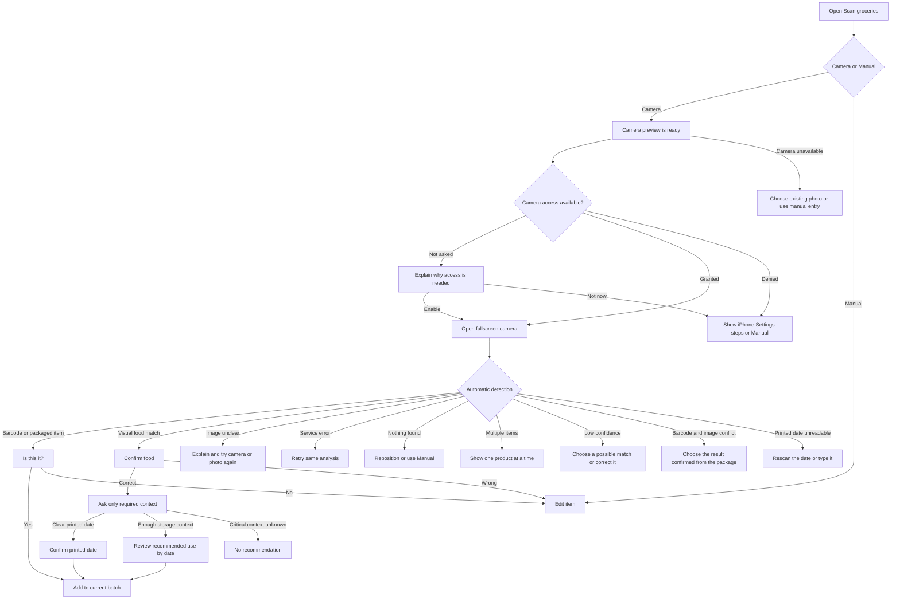

# Unified camera intake journey map

Status: mocked interaction prototype  
Scope: one refrigerated food item in view at a time

## Purpose

This map records the current camera-assisted intake experience as a UI/UX research artifact. Barcode recognition, visual-food recognition, and storage guidance are simulated. The flow is designed to test how CROCS can make scanning feel automatic while recovering from uncertainty without implying that an image proves food safety.

## Current flow

The separate photo capture states remain in the prototype as collapsed edge-case controls. They are implementation and research fallbacks, not a third user-facing intake method.

## State inventory

| State | What the user needs | CROCS response | Primary action | Prototype status |
| --- | --- | --- | --- | --- |
| Scan entry | Choose an intake method | Offer only Camera and Manual | Open camera | Implemented |
| Camera preview | Understand that detection is ready | Show an outward-camera-style feed with one clear tap target | Open camera scanner | Implemented, simulated |
| First-use permission | Understand why camera access is needed | Explain the scanning purpose and state that the prototype does not upload or save images | Enable camera | Implemented, simulated |
| Permission denied | Recover without getting stuck | Give short iPhone Settings steps and preserve Manual entry | I've enabled the camera | Implemented, simulated |
| Fullscreen detection | Hold an item in view | Search automatically for a product, barcode, or printed date | Keep item in view | Implemented, simulated |
| Quick confirmation | Prevent an incorrect item from being logged | Ask “Is this it?” with product and date details | Yes, add it | Implemented |
| Nothing detected | Recover from an empty or unclear frame | Ask for one item with its front label or barcode visible | Try scanning again | Implemented, simulated |
| Multiple products | Know which grocery CROCS will add | Ask the user to leave one item in view | Scan one item | Implemented, simulated |
| Low-confidence match | Resolve ambiguity without accepting a guess | Show a short candidate list and allow correction | Choose a possible match | Implemented, simulated |
| Conflicting results | Resolve a barcode and visual mismatch | Ask which result can be confirmed from the package | Choose one result | Implemented, simulated |
| Unreadable printed date | Preserve a recognized product without inventing a date | Offer another date scan or prefilled manual review | Scan the date again | Implemented, simulated |
| Photo edge cases | Recover from harder visual matches | Keep upload, photo review, and test scenarios available behind collapsed prototype controls | Open photo edge-case scenarios | Implemented |
| Photo review | Check whether the image is usable | Show the selected image and two practical checks | Analyze this photo | Implemented |
| Analysis | Know that work is in progress | Show the image or a simple progress state | Cancel | Implemented, simulated |
| Food confirmation | Catch a wrong suggestion | Show identity, food state, and confidence | Confirm or correct | Implemented |
| Corrected identity | Avoid repeating information | Carry the corrected name into manual details | Continue with this name | Implemented |
| Unclear photo | Understand what failed | Explain likely image problems without blaming the user | Try another photo | Implemented, simulated |
| Analysis error | Recover without starting over | Preserve the photo and offer retry | Try analysis again | Implemented, simulated |
| Camera unavailable | Continue without camera access | Offer existing-photo upload and manual entry | Choose existing photo | Implemented, simulated |
| Context questions | Provide only date-changing facts | Ask one question per screen with a two-question cap | Answer and continue | Implemented for tuna demo |
| Printed-date review | Distinguish a package date from an estimate | Present the label and request confirmation | Confirm date | Implemented for salsa demo |
| Recommendation review | Understand and verify the estimate | Show date, basis, context, confidence, and source | Add to batch | Implemented for tuna demo |
| Unable to recommend | Avoid false precision | Explain why no date was generated | Save manually | Implemented |

## Design hypotheses to test

These are assumptions, not research findings:

- Reviewing a photo before analysis prevents more errors than the extra step creates friction.
- Keeping the photo during a service error makes retry feel safe and efficient.
- Plain-language failure explanations feel less punitive than a generic error message.
- Carrying a corrected name into manual details reduces repetition and preserves trust.
- One question per screen is clearer than a compact form for safety-relevant context.
- A two-question cap prevents the photo path from becoming more burdensome than manual entry.

## Deferred states

- Adding multiple foods from one photograph; the current prototype only asks the user to isolate one item
- Cropping and rotation tools
- Browser-generated camera permission events rather than prototype controls
- Offline recognition and queued analysis
- Conflicting package and government guidance
- Editing a recommendation after it has been saved
- Notification timing and reminder preferences
- Live model confidence, latency, and source-retrieval behavior

## Suggested usability tasks

Ask participants to complete three scenarios without explaining the interface:

1. Add leftover tuna that was prepared today and continuously refrigerated.
2. Add a sealed salsa jar with a visible printed date.
3. Recover from a wrong food suggestion or an unclear photo.

Observe completion, hesitation, repeated input, unnecessary questions, interpretation of the date label, and whether participants understand that the recommendation is not a safety guarantee.
